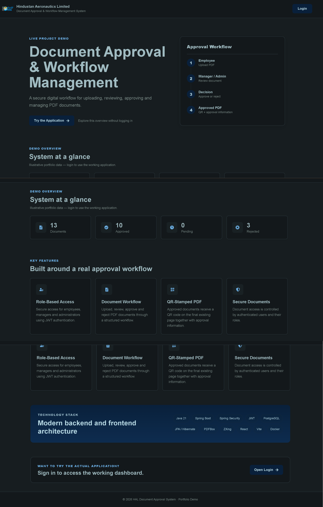
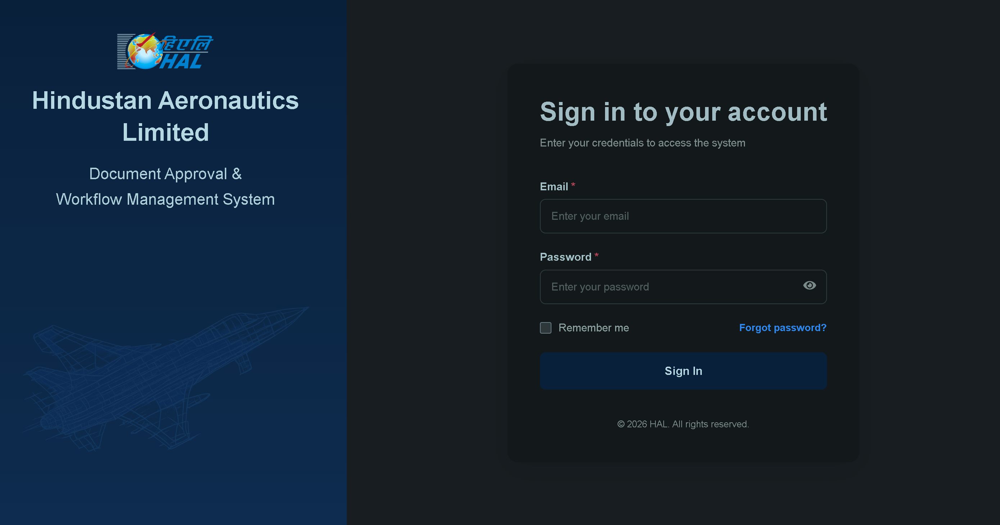
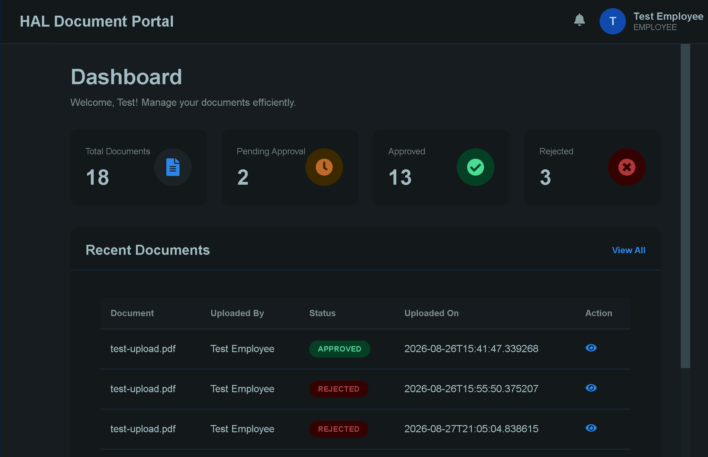
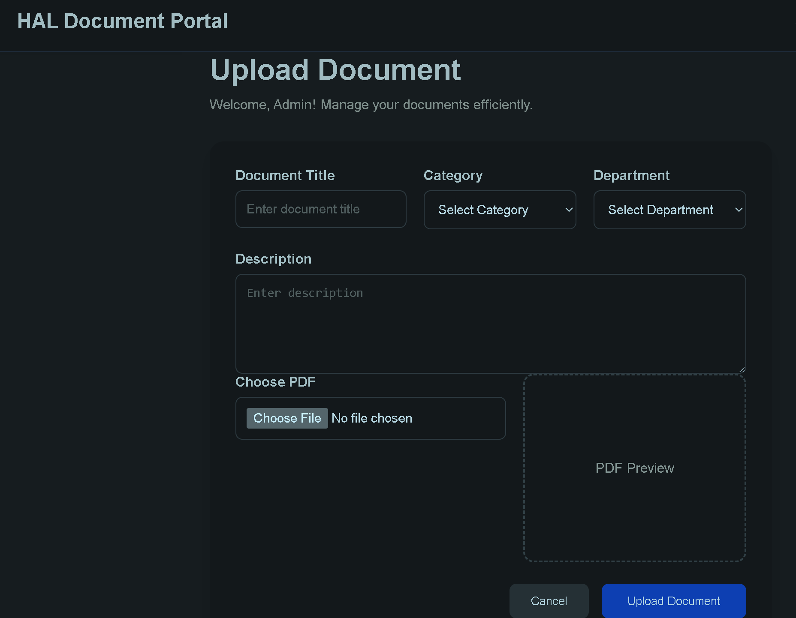
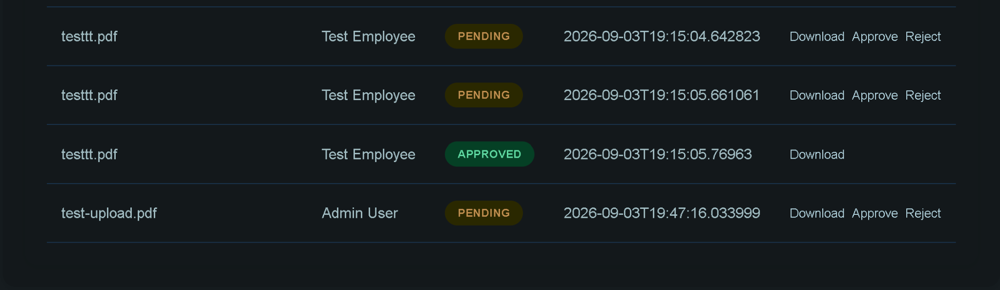
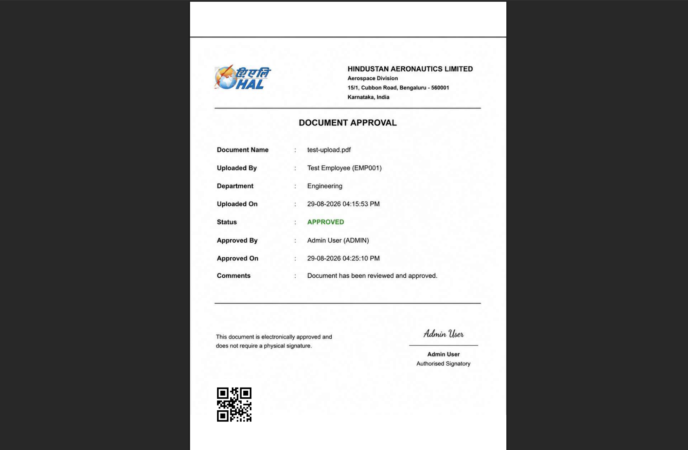

# HAL PDF Approval & QR Verification System

A full-stack document approval system designed to manage PDF documents through a secure employee-manager approval workflow.

The system allows employees to upload documents, managers/admins to review and approve or reject them, and approved PDFs to be generated with a QR code for verification.

---

## 🚀 Features

- 🔐 JWT-based authentication
- 👥 Role-based access control
- 📄 PDF document upload
- 📋 Document management dashboard
- ✅ Manager/Admin approval workflow
- ❌ Document rejection with comments
- 📥 Secure document download
- 🧾 QR code generation for approved documents
- 🐘 PostgreSQL database
- 🐳 Docker & Docker Compose support
- ⚛️ React frontend
- ☕ Spring Boot REST API

---

## 🏗️ System Architecture

```text
                    ┌─────────────────────┐
                    │     React Frontend  │
                    │       (Vite)        │
                    └──────────┬──────────┘
                               │
                               │ REST API
                               ▼
                    ┌─────────────────────┐
                    │   Spring Boot API   │
                    │                     │
                    │  ┌───────────────┐  │
                    │  │ JWT Security  │  │
                    │  └───────────────┘  │
                    │                     │
                    │  Document Service   │
                    │  Approval Workflow  │
                    │  QR PDF Service     │
                    └──────────┬──────────┘
                               │
                               ▼
                    ┌─────────────────────┐
                    │     PostgreSQL      │
                    │      Database       │
                    └─────────────────────┘
````

---

## 🔄 Application Workflow

```text
Employee Login
      │
      ▼
Upload PDF
      │
      ▼
Document Status: PENDING
      │
      ▼
Manager/Admin Reviews
      │
      ├───────────────┐
      │               │
      ▼               ▼
   APPROVE          REJECT
      │               │
      ▼               ▼
Generate QR       Store Comments
      │
      ▼
Approved PDF
with QR Code
      │
      ▼
Secure Download
```

---

## 🛠️ Technology Stack

### Backend

* Java 21
* Spring Boot 3.5
* Spring Security
* JWT Authentication
* Spring Data JPA
* Hibernate
* PostgreSQL
* Apache PDFBox
* ZXing

### Frontend

* React
* Vite
* JavaScript
* Axios
* React Router
* HTML5
* CSS3

### DevOps

* Docker
* Docker Compose
* Nginx
* Maven

---

## 📁 Project Structure

```text
pdf-approval-system/
│
├── src/
│   └── main/
│       ├── java/
│       │   └── com/hal/pdf_approval_system/
│       │       ├── controller/
│       │       ├── service/
│       │       ├── repository/
│       │       ├── entity/
│       │       ├── dto/
│       │       ├── security/
│       │       └── exception/
│       │
│       └── resources/
│
├── frontend/
│   └── pdf-approval-frontend/
│       ├── src/
│       ├── public/
│       ├── Dockerfile
│       ├── package.json
│       └── vite.config.js
│
├── Dockerfile
├── docker-compose.yml
├── pom.xml
├── .env.example
├── .gitignore
└── README.md
```

---

## 👥 User Roles

### Employee

Employees can:

* Login
* Upload PDF documents
* View their documents
* Download their documents
* Track approval status

### Manager / Admin

Managers and administrators can:

* View pending documents
* Review documents
* Approve documents
* Reject documents
* Add approval/rejection comments
* Download approved documents

---

## 📡 Main API Endpoints

### Authentication

```text
POST /auth/login
```

### Documents

```text
POST   /documents/upload
GET    /documents
GET    /documents/{id}
GET    /documents/download/{id}

PATCH  /documents/{id}/approve
PATCH  /documents/{id}/reject

GET    /documents/page
GET    /documents/search
GET    /documents/dashboard/stats
```

---

## 🐳 Running the Project with Docker

### Prerequisites

Make sure you have:

* Docker Desktop
* Git

Clone the repository:

```bash
git clone https://github.com/shoaib-57/Repository-name-hal-pdf-approval-system.git
```

Navigate into the project:

```bash
cd Repository-name-hal-pdf-approval-system
```

Create your environment file:

copy .env.example .env
```


docker compose up --build
```

---

## 🌐 Application URLs

### Frontend

```text
http://localhost:5173
```

### Backend API

```text
http://localhost:8080
```

### PostgreSQL

```text
localhost:5433
```

---

## 🔑 Demo Accounts

For local demonstration:

### Admin

```text
Email: admin@hal.com
Role: ADMIN
```

### Employee

```text
Email: test@hal.com
Role: EMPLOYEE
```


## 📄 PDF Approval & QR Generation

When a document is approved:

1. The approval request is received by the backend.
2. The document status is changed to `APPROVED`.
3. Approval information is stored in PostgreSQL.
4. A QR code is generated using ZXing.
5. Apache PDFBox is used to generate the approved PDF.
6. The approved PDF can then be downloaded.


## 🔒 Security

The application uses:

* JWT authentication
* BCrypt password hashing
* Spring Security
* Role-based authorization
* Protected document access
* Environment variables for sensitive configuration


## 🧪 Tested Workflow

The following workflow has been tested successfully:

```text
Employee Login
      ↓
Upload PDF
      ↓
Admin Login
      ↓
View Pending Document
      ↓
Approve Document
      ↓
Generate QR PDF
      ↓
Download Approved PDF
      ↓
Verify QR Code
```

Document rejection has also been tested.

---

## 📸 Screenshots

Screenshots can be added here to demonstrate:

### 🏠 Landing Page



---

### 🔐 Login Page



---

### 📊 Employee Dashboard



---

### 📄 Document Upload



---

### ✅ Admin Approval



---

### 🔲 Approved PDF with QR Code



## 🔮 Future Improvements

* QR-based public document verification
* Email notifications
* Digital signatures
* Audit logs
* Document versioning
* Advanced search and filtering
* Cloud storage integration
* Production deployment
* API documentation with Swagger/OpenAPI

---

## 👨‍💻 Author

**Shoaib**

GitHub:
[https://github.com/shoaib-57](https://github.com/shoaib-57)

---


